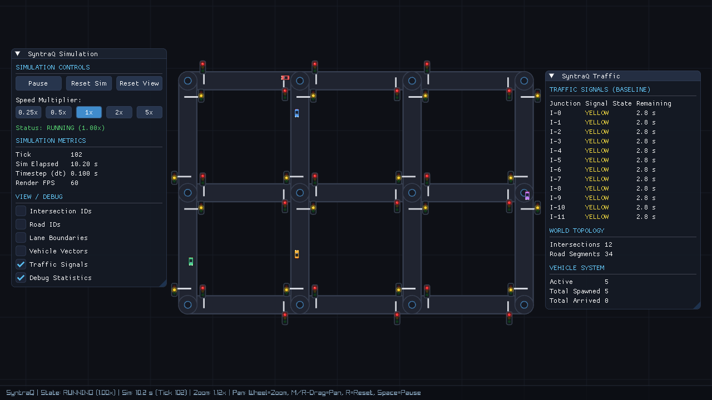

# SyntraQ: Real-time AI-driven Urban Traffic Simulation & Optimization

A research-oriented C++20 simulation platform that models urban traffic and evaluates AI-based traffic management strategies.



---

## Status

> <u>**Note:**</u> SyntraQ is a research-oriented project and is currently **under active development**. Some features may be experimental or incomplete.

| Milestone | Description                              | Status      |
|-----------|------------------------------------------|-------------|
| M1        | Project foundation & simulation loop     | ✅ Complete |
| M2        | Road network & directed graph model      | ✅ Complete |
| M3        | Autonomous vehicle simulation            | ✅ Complete |
| M3.5      | UI & visual polish, camera, timing architecture | ✅ Complete |
| M4        | Baseline traffic signal control (Fixed-Time) | ✅ Complete |
| M4.5      | Three-region UI layout refactor          | ✅ Complete |
| M5        | Shortest-path routing & pathfinding (Dijkstra & A*) | ✅ Complete |
| M6        | Adaptive & AI signal optimization        | Planned     |

---

## Tech Stack

| Component      | Technology                     |
|----------------|--------------------------------|
| Core language  | C++20                          |
| Build system   | CMake 4.x + Ninja              |
| Rendering      | Raylib 6.0 (ARM64 MSVC)        |
| UI / Debug     | Dear ImGui + rlImGui           |
| Tests          | GoogleTest + CTest             |
| CI             | GitHub Actions                 |
| AI deployment  | ONNX Runtime (future)          |
| AI training    | Python / PyTorch (future)      |

---

## Prerequisites

- **Windows ARM64** (tested) or x64
- **Visual Studio 2022** with MSVC ARM64 toolchain
- **CMake ≥ 3.25**
- **Ninja**
- **Git**
- Raylib 6.0 SDK at `D:\Game development projects\raylib-6.0_winarm64_msvc16`

---

## Building

Open a **Developer Command Prompt for VS 2022 (ARM64)** and run:

```powershell
# Configure (Debug)
cmake -B build -G Ninja -DCMAKE_BUILD_TYPE=Debug

# Build
cmake --build build

# Run
.\build\bin\syntraq.exe
```

### Release build

```powershell
cmake -B build-rel -G Ninja -DCMAKE_BUILD_TYPE=Release
cmake --build build-rel
```

### Custom Raylib SDK path

```powershell
cmake -B build -G Ninja -DRAYLIB_SDK_DIR="C:/path/to/raylib"
```

---

## Running Tests

```powershell
cd build
ctest --output-on-failure
```

Or run a specific test binary directly:

```powershell
.\build\bin\test_simulation.exe
```

---

## Project Structure

```
SyntraQ/
├── include/syntraq/
│   ├── core/          # Config and shared types
│   ├── world/         # Road network graph (Intersections & Roads)
│   ├── vehicles/      # Vehicle agents, kinematics, and spawner
│   ├── signals/       # Traffic signals (Lights, Phases, Controllers)
│   ├── routing/       # Routing engine (Dijkstra, A*, Heuristics, Costs)
│   ├── simulation/    # Headless simulation loop
│   └── rendering/     # Raylib + ImGui renderer
├── src/
│   ├── core/          # Config implementation
│   ├── world/         # Road network implementation
│   ├── vehicles/      # Vehicle systems and spawner
│   ├── signals/       # Traffic signal controllers
│   ├── routing/       # Dijkstra, A*, and graph generator
│   ├── simulation/    # Simulation implementation
│   ├── rendering/     # Renderer implementation
│   └── main.cpp       # Entry point
├── tests/             # GoogleTest suites (129 tests)
├── benchmarks/        # Reproducible routing benchmarks
├── configs/           # Scenario JSON files
├── assets/            # Fonts, textures (future)
├── models/            # ONNX models (future)
├── scripts/           # Python training scripts (future)
├── data/              # Runtime metrics output (gitignored)
└── docs/              # Documentation
```

---

## Architecture Principles

1. `syntraq_core` (static lib) — headless, no Raylib, fully testable
2. `syntraq_renderer` — all Raylib/ImGui calls isolated here
3. `syntraq` — thin entry point only
4. Simulation reads Config once at startup; no global state
5. Renderer reads `SimState`; never writes to Simulation
6. Route generation isolated behind `IRouteProvider` / `IRouter` interface (A*, Dijkstra, Greedy)
7. Modular routing engine supports configurable weighted costs (distance, travel time) and heuristics (Euclidean, Manhattan, zero)

---

## Simulation Controls & Timing

### Camera Controls
- **Mouse Wheel**: Smooth zoom towards cursor position (0.25× – 4.0×).
- **Middle Mouse Drag** or **Right Mouse Drag**: Pan the viewport.
- **R Key** or **Reset View Button**: Frame and center the road network within the active viewport.
- Window resizing dynamically adapts the viewport and preserves network centering.

### Simulation Controls (UI & Keyboard)
- **Space** or **Pause / Resume Button**: Toggle simulation execution.
- **Reset Sim Button**: Resets simulation clock, vehicles, and network to $t=0$.
- **Speed Multipliers**: `0.25×`, `0.5×`, `1×`, `2×`, `5×` presets.

### Debug Visualizations (Disabled by default)
- **Intersection IDs**: Technical ID badges on junction nodes.
- **Road IDs**: Segment ID labels centered along road links.
- **Lane Boundaries**: Visible lane boundary guidelines.
- **Vehicle Direction Vectors**: Forward heading vectors and tips from vehicles.
- **Debug Statistics**: Simulation metrics (Tick, Sim Time, Render FPS), world topology, and vehicle counts.

### Fixed-Timestep Architecture
Simulation advancement is decoupled from rendering frame rate:
$$\text{Real elapsed time} \xrightarrow{} \text{Accumulator} \xrightarrow{} \text{Fixed timestep } (\Delta t = 0.10\,\text{s}) \xrightarrow{} \text{Simulation updates} \xrightarrow{} \text{Rendering}$$

Guarantees identical, deterministic simulation progression regardless of rendering display refresh rate (60 Hz, 144 Hz, vsync off, or headless).

---

## License

This project uses GNU GPL3.0 license. Refer [LICENSE](LICENSE) for more details.
